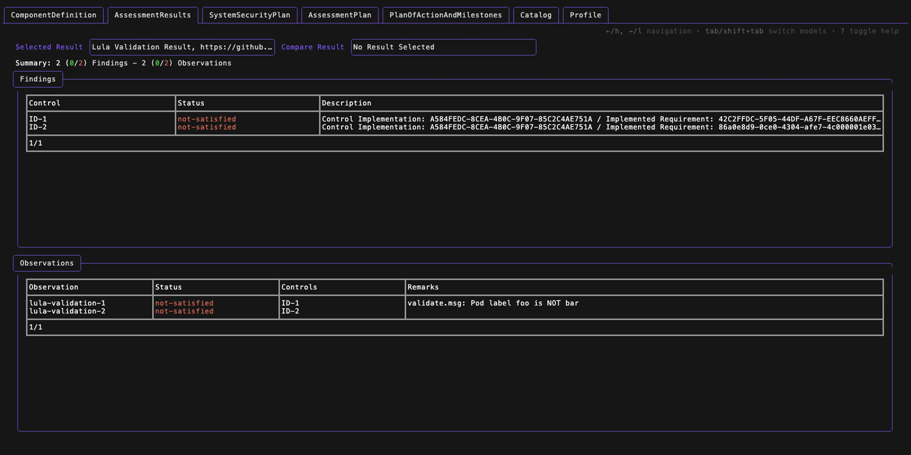
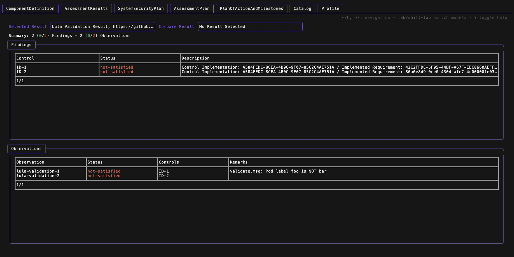

# Assessment Results

The Assessment Result view provides the Console user with an interactive experience of the OSCAL Assessment Results model. The view supports navigation between the different results contained in the Assessment Results model, as well as the ability to view Findings and Observations in tabular and filterable formats. Additional `detail` views are available to view the raw OSCAL model data for selected Findings/Observations.

## Usage

The Assessment Results model supports the following views:
 * [Result View](./assessment-results.md#result-view)
 * [Result Comparison View](./assessment-results.md#result-comparison-view)

## Keys

The Assessment Results model responds to the following keys for navigation and interaction (some widgets have additional key response, see respective help views for more information):

| Key | Description |
|-----|-------------|
| `?` | Toggle help |
| `ctrl+c` | Quit |
| `tab` | Tab right between models |
| `shift+tab` | Tab left between models |
| `←/h` | Navigate left across widgets in model|
| `→/l` | Navigate right across widgets model |
| `↑/k` | Move up in table OR scroll up in panel |
| `↓/j` | Move down in table OR scroll up in panel |
| `/` | Filter table |
| `↳` | Select available item |
| `d` | Detail available item (findings and observations) |
| `esc` | Close OR esc filtering |

During console viewing, the top-right corner will display the help keys availble in the context of the selected widget. When an overlay is open, the help keys will be displayed in the overlay.

## Views

### Result View

### Result Comparison View

